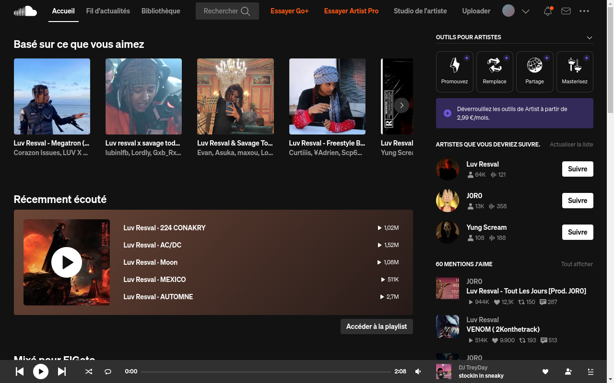
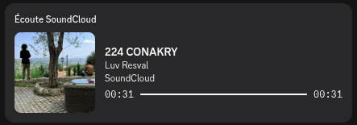

<div align="center">

# 🎧 SoundcloudApp-LinuxWindows

**SoundCloud as a real app on your computer — with your media keys, a tray icon,
your track on Discord, and no ads.**

[](LICENSE)
[](https://www.electronjs.org/)
[](https://github.com/xBibouu/SoundcloudApp-LinuxWindows/issues)




</div>

## What it is

SoundCloud, as an actual app instead of a browser tab.

It's the real SoundCloud, and you sign in with your own account, so your likes,
your playlists, your history and your recommendations are all exactly where you
left them. What changes is everything around it: the music keys on your keyboard
work, it lives in your system tray, it tells Discord what you're listening to,
and the ads are gone.

## What you get

🎹 **Your media keys work.** Play, pause, skip — even when the window is hidden
behind everything else.

🎵 **It's in your tray.** Play/pause, next, previous and like, without bringing
the window back.

🖥️ **Your desktop knows what's playing.** The track shows up in your volume
panel and media widget, with the cover art, like Spotify does.

🔔 **Notifications** when the track changes, with the cover.

❌ **Close it, the music keeps playing.** It goes to the tray instead of quitting.

🚫 **No ads.** On by default, and you can switch it off if you want.

🎮 **Your track on Discord.**

<div align="center">



</div>

## Get it

There's no ready-made download yet, so you build it once yourself. It's two
commands and you need [Node.js](https://nodejs.org/) installed:

```bash
npm install
npm run dist:linux     # or: npm run dist:win
```

The files land in the `dist/` folder. Take whichever suits you:

| File | For | How to use it |
|---|---|---|
| `.AppImage` | Any Linux — **easiest** | Double-click it, or `./SoundcloudAppLinuxWindows-*.AppImage` |
| `.flatpak` | Linux, sandboxed | `flatpak install --user --bundle dist/*.flatpak` |
| `.deb` | Ubuntu, Debian, Mint | `sudo apt install ./soundcloud-app-*.deb` |
| `.rpm` | Fedora, openSUSE | `sudo dnf install ./soundcloud-app-*.rpm` |
| `Setup.exe` | Windows | Run it |
| `portable.exe` | Windows, no install | Run it |

Not sure? Take the **AppImage**. It runs almost everywhere and installs nothing.

Just want to try it without building? `npm install && npm start`.

## Signing in

Open the app and click **Sign in**, same as on the website.

- **SoundCloud email and password** — happens right there in the app.
- **Google, Facebook or Apple** — a real browser window opens, you sign in
  there, and the app picks it up on its own. Close the browser and you're done.

That second one goes through a browser because Google refuses to let you sign in
from inside an app like this one. It's a rule on their side, not something that
can be worked around. Any browser based on Chrome does the job: Chrome,
Chromium, Edge, Brave, Opera, Opera GX, Vivaldi or Yandex.

Already signed in somewhere else? **File ▸ Import session from browser** can
take your existing SoundCloud session straight out of your browser, no password
needed.

## Shortcuts

| Key | What it does |
|---|---|
| `Ctrl+P` | Play / pause |
| `Ctrl+←` `Ctrl+→` | Previous / next track |
| `Ctrl+L` | Like what's playing |
| `Alt+Home` | Back to the home page |
| `Ctrl+Q` | Quit |

Your keyboard's own music keys work too, anywhere.

## Good to know

**The ad blocking doesn't remove audio ads.** It gets rid of the banners and the
trackers, but SoundCloud plays audio ads through the same channel as normal
tracks, so there's no way to tell them apart without breaking the player.

**Discord won't show the button on your own profile.** That's a Discord thing —
other people see it, you don't. Ask a friend if you want to check.

**On Linux, `npm start` may complain about `chrome-sandbox`.** Run
`npm run fix-sandbox` once and it's sorted. Installed versions never have this
problem — it only affects running from the source folder.

**Something broken after a SoundCloud update?** They change their website from
time to time, which can confuse the app.
[Open an issue](https://github.com/xBibouu/SoundcloudApp-LinuxWindows/issues)
and say what's not working — but never post your password or your cookies.

<details>
<summary><h2>For developers</h2></summary>

### Building

```bash
npm install
npm start                # run from source
npm run dev              # + DevTools and playback-state logging

npm run dist:linux       # AppImage + deb + rpm + Flatpak
npm run dist:win         # Windows installer + portable (needs wine on Linux)
npm run dist             # everything
npm run checksums        # SHA256SUMS for everything in dist/
```

Per-target prerequisites: `.deb` needs `binutils`, `.rpm` needs `rpm`, the
Windows targets need `wine`, Flatpak needs `flatpak-builder` and its runtimes.
The AppImage needs none of them. A missing `rpmbuild` aborts the run *before*
the later targets are built, so drop `rpm` from the list if you don't have it.

### Flatpak

```bash
sudo apt install flatpak-builder
flatpak remote-add --user --if-not-exists flathub https://dl.flathub.org/repo/flathub.flatpakrepo
flatpak install --user flathub org.freedesktop.Sdk//24.08 org.electronjs.Electron2.BaseApp//24.08
npm run dist:flatpak
flatpak install --user --reinstall --bundle dist/SoundcloudAppLinuxWindows-0.1.0-x86_64.flatpak
flatpak run io.github.gato.soundcloud
```

Rebuilding the bundle does **not** update an installed copy — repeat the
`flatpak install --bundle` step. It's a local bundle, not a repository, so
`flatpak update` never sees it.

Startup prints `Failed to connect to socket /run/dbus/system_bus_socket`:
Chromium probing the *system* bus, which Flatpak deliberately doesn't expose.
Harmless — the session bus, where MPRIS lives, works.

### Layout

| Path | Role |
|---|---|
| `src/main/index.js` | entry point, menus, tray wiring, Discord updates |
| `src/main/window.js` | window creation, navigation and popup routing |
| `src/preload/player-bridge.js` | reads playback state out of the SoundCloud page |
| `src/main/mpris.js` | MPRIS / D-Bus interface |
| `src/main/adblock.js` | request blocking and cosmetic filtering |
| `src/main/discord-presence.js` | Discord RPC client |
| `src/main/browser-login.js` | provider sign-in through a real browser |
| `src/main/cookie-import.js` | reads sessions out of browser cookie stores |
| `src/main/cdp.js` | dependency-free Chrome DevTools Protocol client |
| `src/main/user-agent.js` | Chrome identity (User-Agent + client hints) |

There is no API access: the preload bridge reads the DOM of the web player and
reports title, artist, artwork, position, duration and play state to the main
process, which fans it out to MPRIS, the tray, notifications and Discord. A
SoundCloud markup change is therefore the most likely cause of breakage, and the
selectors at the top of `player-bridge.js` are the one place to fix it.

### Why provider sign-in needs a real browser

Google refuses OAuth from embedded browsers and doesn't go by the User-Agent
alone. Even with the User-Agent and client hints rewritten, `userAgentData`
still reports "Chromium" with no "Google Chrome" brand and `window.chrome` is
nearly empty — neither of which Electron can hide. The app therefore launches a
real Chromium-family browser with a throwaway profile and remote debugging,
then lifts the resulting soundcloud.com cookies into its own session.

The profile is deliberately empty: transplanting existing Google cookies was
tried and removed, since only the subset the app can decrypt would ever
transfer, and Google rejects a partial cookie jar with `CookieMismatch`.

### Ad blocking

The blocklist in `src/main/adblock.js` was built from the hosts soundcloud.com
actually contacts, rather than from a generic filter list, so it stays narrow.
`sndcdn.com` and `*.soundcloud.com` are allow-listed ahead of every block rule,
so no entry can mute the player.

</details>

## Legal

This app contains **no SoundCloud content and no accounts**. It opens
soundcloud.com in a window and you sign in yourself, so SoundCloud's terms apply
exactly as they do in your browser.

MIT licensed — see [`LICENSE`](LICENSE). An independent project, not affiliated
with, endorsed by, or supported by SoundCloud.
